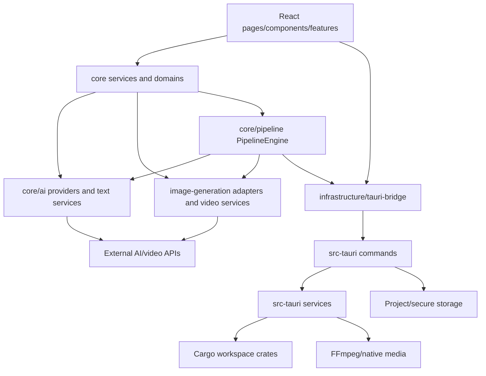
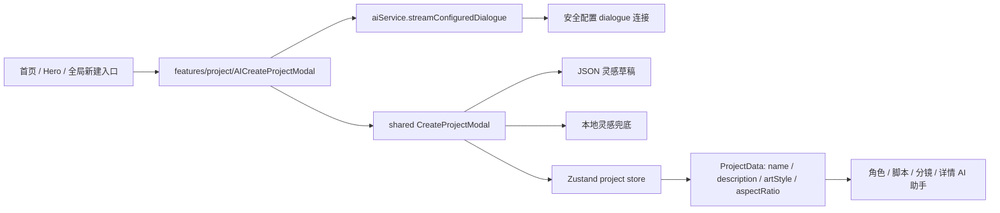
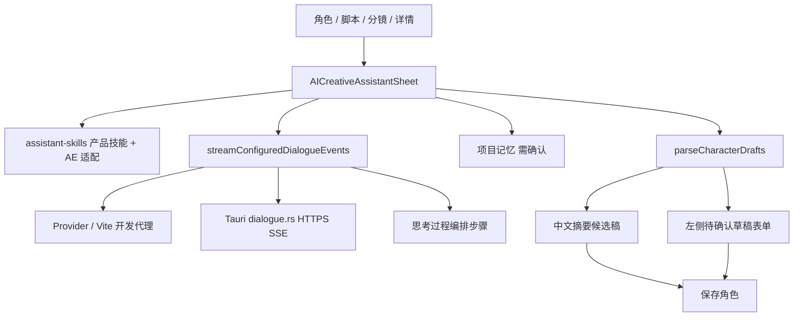
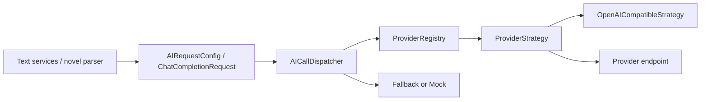
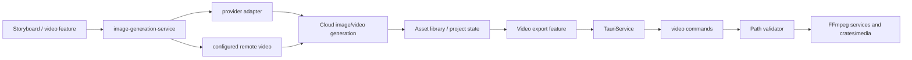
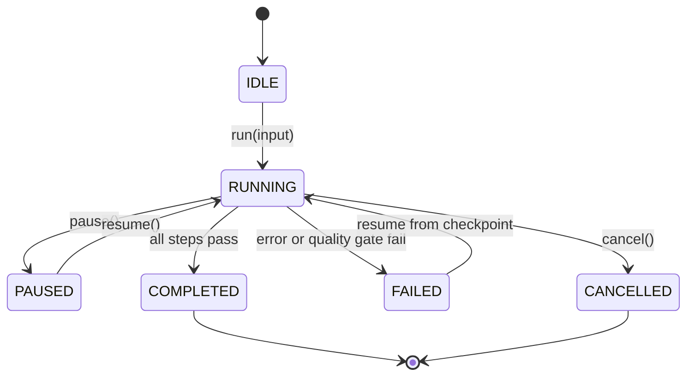
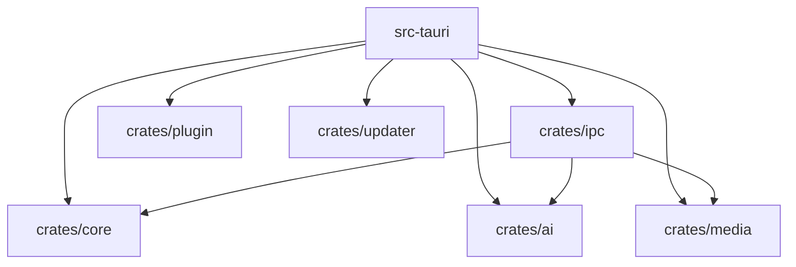

# Novella 架构与调用图谱

## 总体图



## 新建工程 AI 灵感与上下文图



边界说明：shared 弹窗只处理表单、解析和降级；feature 适配层负责把非敏感创作上下文转换为对话消息；连接地址和密钥只在 service/configuration 层读取。

## 创作助手对话与角色回填图



边界说明：角色解析成功即预览回填；保存角色才写已确认列表。脚本/分镜默认仍走填充确认弹窗。字符串化 JSON 不得作为聊天气泡主视图。

## AI 请求图



## 设置与素材生成图

```mermaid
flowchart TD
  Settings[SettingsPage 三张连接卡]
  Store[ai-connection-settings / secureStorage]
  Dialogue[configured dialogue]
  ImageCfg[configured-image-service]
  VideoCfg[remote-video-service]
  LegacyImg[Seedream / Kling / Vidu 回退]
  PublicURL[仅公网 http(s) 素材]

  Settings --> Store
  Store --> Dialogue
  Store --> ImageCfg
  Store --> VideoCfg
  ImageCfg -->|无图片 Key| LegacyImg
  VideoCfg --> PublicURL
```

边界说明：设置页不暴露协议细节。本地路径、Blob、base64 在视频请求构建层阻断。默认 vendor URL 以源码配置为准，不视为已确认的产品合作关系。

## 视频生成与本地渲染图



## Pipeline 状态图



## Rust crate 关系



## 图谱边界

这是基于 `git ls-files`、配置、导出入口和调用点的静态关系图。完整 import 图需要安装依赖并执行 `pnpm exec madge` 或 dependency-cruiser；本次没有把未执行的工具结果伪装成已验证事实。
