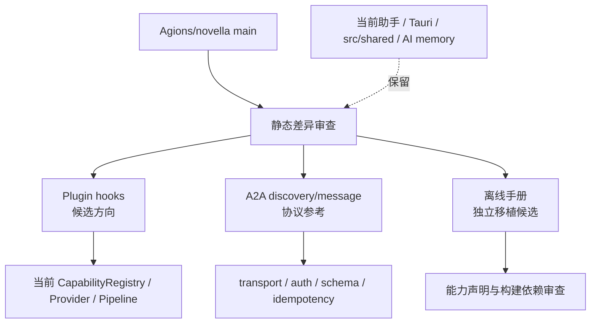
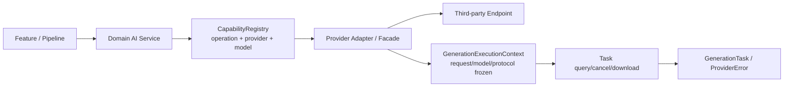

# 架构图谱入口

- Mermaid 图谱：`docs/03-analysis/architecture-graph.md`
- 本轮已补充新建工程 AI 灵感与项目上下文传递图，覆盖 feature adapter、shared 表单、configured dialogue 和 project store。
- 本轮已补充创作助手对话与角色回填图：Sheet、技能分层、Web/Tauri 双轨传输、候选稿摘要、预览回填与对话内保存。
- 本轮进一步补充 Agent / feature reducer / React effects 三层状态所有权，以及 turn-ID 陈旧终态防护。
- 本轮补充生成参考图全链路：configured image、Tauri JSON/SSE/Base64 解析、项目 `assets/images` 落盘、相对路径持久化、受控 IPC 读取、角色卡与助手消息预览。
- 图谱同步记录路由项目 ID、跨项目 fallback 拒绝和异步旧快照保护，避免生成资产写入错误工程或被水合覆盖。
- 本轮已补充设置三连接面与图片/视频配置优先路由图；视频请求只接受公网 URL。
- Shallow dependency graph：`docs/ae/graphs/graph.json` 记录 2026-08-23 对 `src/features/creative-assistant` 的完整浅层扫描（17 nodes / 37 relative-import edges），fingerprint `63f72b64ef679b4ffab3beaa09fed1d19ba324156e6dbea8fb9664a3240f8f2e`。
- 图谱限制：未安装依赖时无法声称完整 import 解析；动态 import、生成代码和框架别名可能缺失。

## 2026-09-13 上游同步边界

- 上游主分支不是当前项目的可直接合并基线。
- `src/shared -> src/common`、助手/Tauri 删除和项目身份变化被标记为排除项。
- 此图表达静态评估结果，不证明任何上游运行时能力已进入当前项目。
- 详细证据：`docs/ae/reports/upstream-novella-sync-assessment-2026-09-13.md`。

## 2026-09-13 统一能力封装补充

- `src/core/services/ai/capability-registry.ts` 提供能力注册、查找和执行上下文创建。
- `src/core/services/ai/unified-generation-types.ts` 定义统一 operation、task、context 和 error 契约。
- `src/core/services/ai/video/remote-video-service.ts` 在提交时冻结上下文，并在轮询时复用。
- 2026-09-13 Windows 验证已通过 TypeScript、lint、Jest、Vite build、docs check、Cargo check 和循环依赖检查；Tauri 安装程序运行及真实 Provider 仍未验证。
